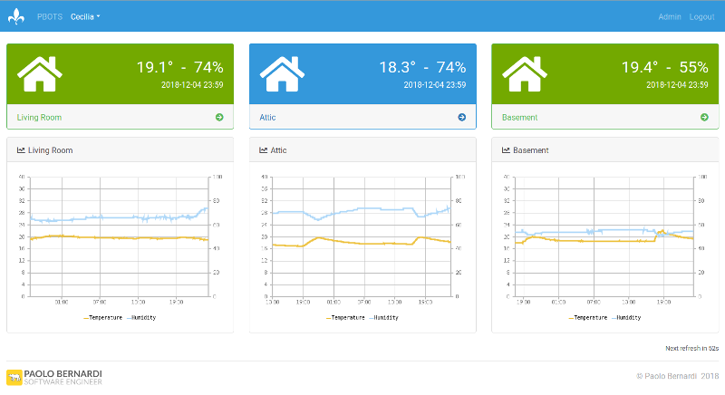
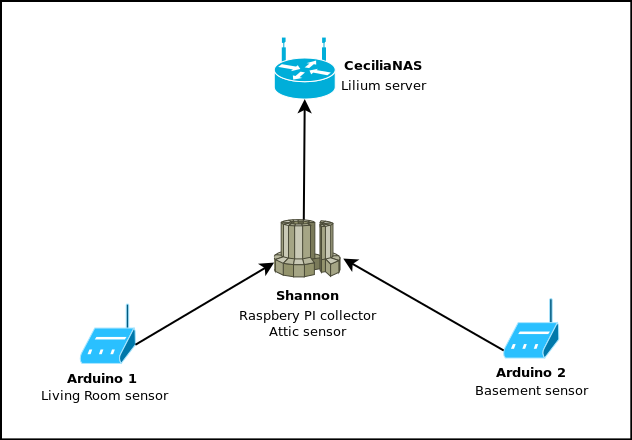
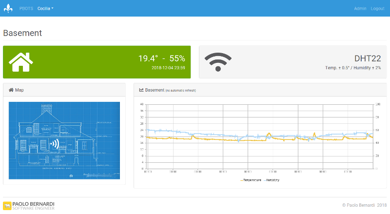
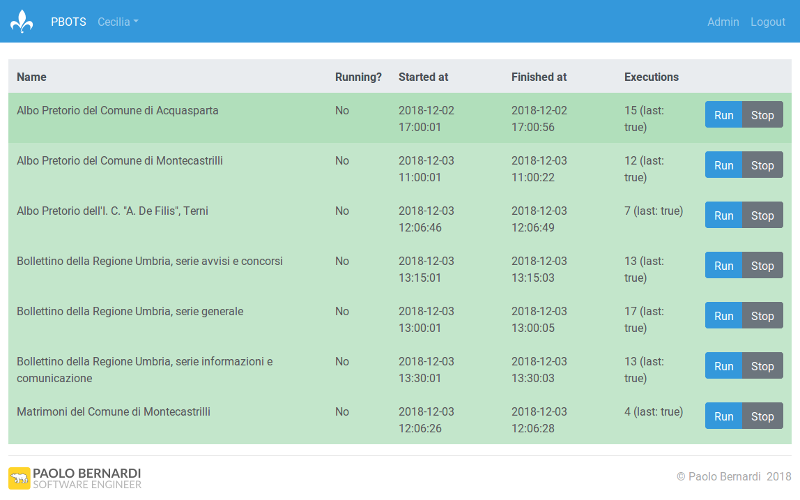

<a href="https://www.bernardi.cloud/">
    
</a>

# Lilium
> A collection of seemingly unrelated Paolo Bernardi's personal tools with cool code names!

[](https://www.python.org)
[](https://opensource.org/licenses/AGPL-3.0)
[](https://github.com/bernarpa/lilium/issues)

## Table of content

- [What is Lilium](#what-is-lilium)
    - [Cecilia](#cecilia)
    - [PBOTS](#pbots)
- [Installation](#installation)
    - [Lilium setup](#lilium-setup)
    - [Cecilia setup](#cecilia-setup)
    - [PBOTS setup](#PBOTS-setup)
- [Code names](#code-names)
- [License](#license)

## What is Lilium

Lilium is a software system composed by a varied set of modules; the only thing that they have in common is being developed and used by Paolo Bernardi.

So far, Lilium includes the following modules:
  * **Cecilia**, a network of temperature and humidity sensors deployed throughout Paolo Bernardi's home (whose code name is, incidentally, Cecilia).
  * **PBOTS**, a collection of web scrapers and a mailing system to notify updates of the target data sources.

The most prominent feature of the Lilium system is the web interface: Lilium is a Django project and each module is an app that implements some sort of dashboard or "command and control" interface.  However, the modules usually need some back-end support programs as well: they can be found in the `tools` directory within each module's Django app.

### Cecilia

Cecilia is a distributed temperature and humidity sensor network, currently deployed at Paolo Bernardi's house.



Cecilia exploits several hardware components to form a distributed sensor network:
  1. Several Arduino Uno with DHT22 sensors.
  2. A Raspberry PI, which collects data from the Arduino units and, optionally, from a DHT22 sensor that can be wired directly to its GPIO pins.

The Arduino sensors can be connected to the local Ethernet network (you'll need an Ethernet shield) or to the Raspberry PI via a USB cable. For example, Paolo Bernardi house's topology is as follows:



The source code, located in the `cecilia` directory, is structured in 3 separate components:
  1. a web dashboard (the Django views, models, urls, templates and static files) that shows an overview and a detailed view of each configured sensor;
  2. a data collector script that gathers temperature and humidity readings from DHT22 sensors directly wired to a Rapberry PI or to Arduino UNO units, which in turn are connected to the Raspberry PI via Ethernet or USB;
  3. firmwares for Arduino Uno units wired to DHT22 sensors, connected to the network with Ethernet shields or directly to the Raspberry PI via USB.

In the `tools` sub-directory there are the collector scripts and the Arduino firmwares.



### PBOTS

PBOTS is a set of web scrapers that collects web publications and notifies news ones via email to a set of subscribers.



The source code, located in the `pbots` directory, is structured in 3 separate components:
  1. a web dashboard (the Django views, models, urls, templates and static files) that shows the web scrapers status;
  2. a set of web scraping scripts (so far there are Python, PhantomJS and CasperJS scripts);
  3. a script to trigger the PBOTS web scrapers from the command line.

## Installation

### Lilium setup

Prerequisites:
  1. Python 3 with Django, BeautifulSoup and Requests.
  2. PhantomJS
  3. CasperJS

Lilium can be deployed as a normal Django application:
  1. Copy `lilium/local_settings.py-sample` to `lilium/local_settings.py` and edit the latter to match the local machine's configuration.
  2. Apply the migration to your DB with `python manage.py migrate`.
  3. Run it with `python manage.py runserver 192.168.0.1:1234` (for development and testing purposes) or configure it with a more robust setup.

### Cecilia setup

The setup of Cecilia involves several steps other than Lilium's base configuration, on the Arduino units and on the Raspberry PI collector:
  1. Flash the Arduino units with the appropriate firmware.
  2. Install the Arduino units by plugging them to the local LAN or to the USB port of the Raspberry PI.
  3. Install the collector scripts on the Raspberry PI.
  4. Change the `SERVER_URL` variable in `collectors.py`.
  5. Add the relevant `collector_*.sh` scripts to `/etc/rc.local`.

### PBOTS setup

By default the web scrapers managed by PBOTS run only on demand (by clicking the "Run" button on the PBOTS table). You might want to add some rows to your crontab to run them periodically. For example:

```
0 18 * * * /opt/bin/python3 /share/homes/rnd/lilium/pbots/tools/trigger_pbots.py 1
0 12 * * * /opt/bin/python3 /share/homes/rnd/lilium/pbots/tools/trigger_pbots.py 2
0 14 * * * /opt/bin/python3 /share/homes/rnd/lilium/pbots/tools/trigger_pbots.py 3
15 14 * * * /opt/bin/python3 /share/homes/rnd/lilium/pbots/tools/trigger_pbots.py 4
30 14 * * * /opt/bin/python3 /share/homes/rnd/lilium/pbots/tools/trigger_pbots.py 5
30 18 * * * /opt/bin/python3 /share/homes/rnd/lilium/pbots/tools/trigger_pbots.py 6
30 12 * * * /opt/bin/python3 /share/homes/rnd/lilium/pbots/tools/trigger_pbots.py 7
```

The numbers corresponds to the primary key `id` of the `pbots_source` table.

Should you decide to deploy Lilium on a QNAP NAS, as Paolo Bernardi actually did, you might follow this procedure to update the crontab:

```
# vi /etc/config/crontab          # This file survives to system updates
# crontab /etc/config/crontab
# /etc/init.d/cron.sh restart
```

# License

Lilium is licensed under the terms of the GNU Affero General Public License version 3.

# Code names

As it should be clear by glancing at this README, Paolo Bernardi loves code names: :wink:
  * **Lilium**, the project name, doesn't have a specific meaning: it is just the Latin name for the lily flower. Most importantly, this code name facilitated the design of the project logo since fleur-de-lis outlines are widespread and well-known. A previous attempt at naming the project, "Iris", fell short of a decent logo design.
  * **Cecilia**, the sensor network module name, takes after the code name of Paolo Bernardi's house, which in turn is inspired by its location: St. Cecilia is the patroness saint of [Acquasparta](https://en.wikipedia.org/wiki/Acquasparta).
  * **PBOTS**, the web scraper and mailing list module, is a pun on Paolo Bernardi name which just sounds good and barely applicable to this context (after all, a scraper is a kind of bot).
